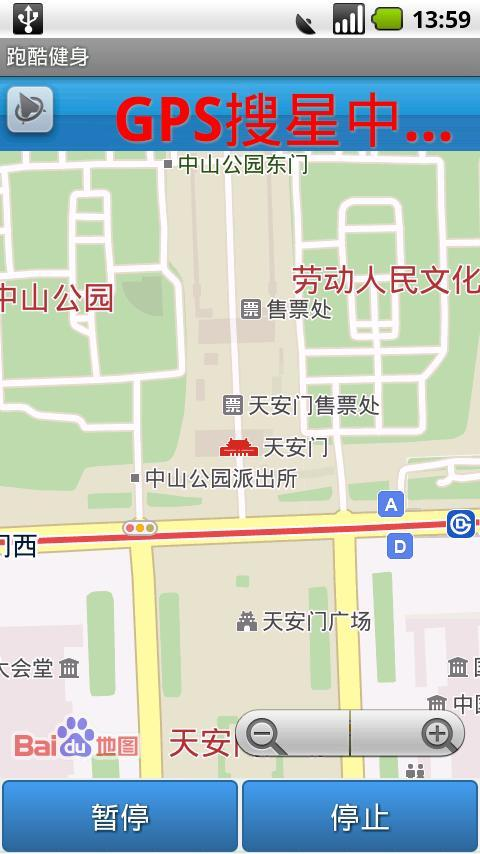
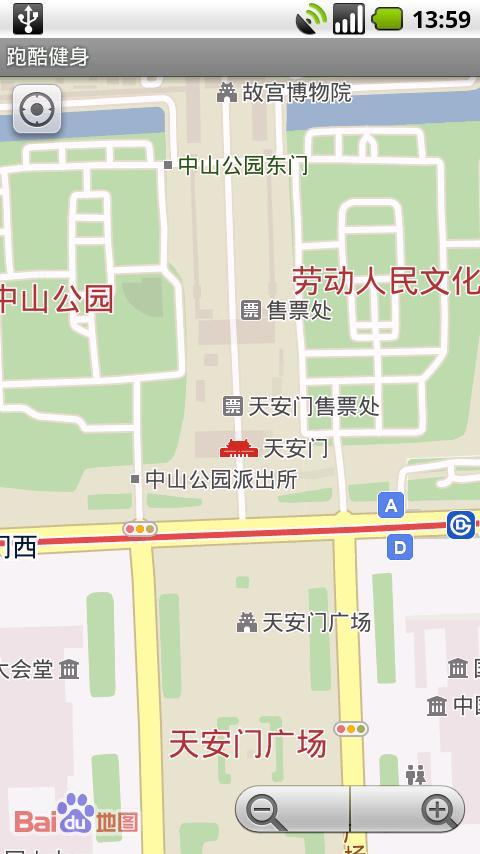
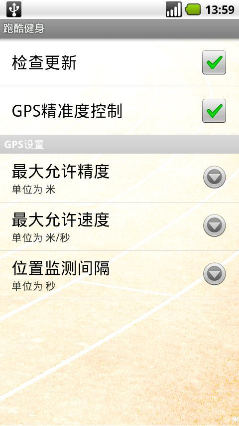

# **功能介绍** #

----------
[机锋市场下载](http://apk.gfan.com/Product/App336690.html)
[淘宝软件市场下载](http://app.taobao.com/software/detail.htm?appId=28723)
[应用汇](http://www.appchina.com/app/com.colobu.flyrunner/)
[腾讯应用宝](http://android.myapp.com/android/appdetail.jsp?appid=586180&g_f=990935)
[91手机门户](http://apk.91.com/Soft/Android/com.colobu.flyrunner-1.0.1.html)

跑酷健身是一款完全免费的跑步健身软件。它通过GPS导航定位，可以实时的通过地图跟踪您的跑步路线，智能计算你的步伐速度，保存跑步记录并且可以随时调阅且在地图上展示出来。

- 支持离线地图的模式，轻松帮助你节省流量。

- 支持多种跑步方式，可以所以跑步，也可是设定跑步长度或者跑步时间，一切尽在您的计划中。
离线地图

- 跑酷健身软件采用百度地图显示跑步路线。

- 百度地图支持离线模式，可以为您节省大量的流量。

- 百度地图为国内用户提供了最新的离线地图，并且无需联网您也能使用地图浏览。不必担心地图服务商服务的稳定性

地图文件较大，建议您在wifi或者PC上下载百度地图，然后复制到手机的存储卡中。

	请到百度官方网站http://shouji.baidu.com/map/map.html下载地图

选择相应的手机类型和城市进行下载

注意：当前的百度地图仅支持旧版格式的离线地图。

## **安装方法** ##

----------

    解开下载的地图文件，可以看到BaiduMap文件夹。

    进入此文件夹，可以看到Mapdata文件夹。

    将Mapdata文件夹复制到手机存储卡的BaiduSDK文件夹中。

    打开跑酷健身软件，选择离线地图页面，可以看到刚刚下载的离线地图。

## **软件设置** ##

----------

在软件设置页面，您可以设置软件是否会自动检查更新。

你还可以GPS参数设置。
设置参数 	说明
检查更新 	允许程序检查新版本。当有新版本发布时，提示更新新版本
GPS精准度控制 	允许程序根据GPS信号和速度剔除误差比较大的数据
最大允许精度 	从GPS得到的数据的精度如果大于此值，数据会被丢弃
最大允许速度 	根据GPS得到的当前点的速度，如果速度大于此值，数据将被丢弃
位置监测间隔 	获取两点之间的时间间隔。建议此值不要太短，太短GPS数据不准确，也不宜太长，太长时跑步细节容易被忽略

## **校正地图** ##

----------

当前百度地图和GPS数据可能会有些不一致。

需要您通过校正地图的功能进行较正。
校正方法

    在主菜单页面点击"校正位置"。

    第一次进入可能GPS需要搜星，此过程较长，请耐心等待

    软件获得GPS数据后会在地图上描绘一个红点。

    在地图上点击您当前的实际位置，软件会在您的点击处描绘一个绿点。

    点击左上角的校正按钮，校正参数会被保存下来。返回主菜单选择其它的功能

# **开始跑步** #

----------

跑酷健身提供了三种跑步类型
## **随意跑** ##

不限时间和距离，随意跑

点击地图下方的开始按钮开始记录。点击暂停可以暂停记录

点击停止按钮停止记录
## **定时跑** ##

你可以选择跑步时间，到时间后软件会发送通知提醒您。

根据您手机的设置它可能通过铃声/震动/发光等方式提醒您。
## **定长跑** ##

你可以选择跑步长度，到时间后软件会发送通知提醒您。

根据您手机的设置它可能通过铃声/震动/发光等方式提醒您。
## **历史记录** ##

你可以查看您的跑步历史记录。